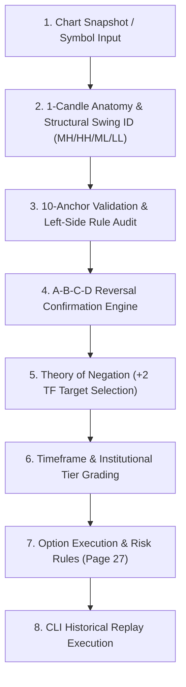

# 📊 Datta Price Action Validation Skill

This skill guides the agent in forensically auditing, validating, and backtesting price action trading setups against **Mr. Datta's 33-Page Master Blueprint** (`Master_Price_Action_Blueprint_FINAL.md`) and the **Ground-Truth Chart Archive** (`G:\Poovendan\AI\Trading\Share\RefDoc\Chart\Datta`).

---

## 🎯 Master Validation Workflow



---

## 📐 Step-by-Step Validation Procedure

### Step 1: Structural Swings & Candle Anatomy (Pages 2 – 5, 18 – 20)
1. **Identify Swing Structure**:
   * **Momentum High (MH)**: Highest candle of an upward swing.
   * **Higher High (HH)**: 1st candle that breaks MH.
   * **Momentum Low (ML)**: Lowest candle of a downward swing.
   * **Lower Low (LL)**: 1st candle that breaks ML.
2. **Inter-Swing Spacing Rule**:
   * **MANDATORY**: Must have **more than 2 candles** in between swings ($>2$ candle gap).

---

### Step 2: 10-Anchor Identification & Left-Side Rule (Pages 3, 6 – 15)

#### 🟢 5 Bullish Reversal Anchors:
1. **`find_anchor_ll_sweep` (Two Lower Lows / LL Sweep — Pages 8–10)**:
   * $L_1$ and $L_2$ pivot lows where $L_2 < L_1$.
   * **Schematic Rule (Image 22)**: $L_2$ candle **MUST BE RED** (downward liquidity grab).
   * **Floor Protection**: Next candle after $L_2$ does **NOT break $L_2$'s low** (`<< LOW NOT BREAK`).
   * **Benchmark ($BM$)**: `Low 2's High`. **Stop-Loss ($SL$)**: `Low 2's Low - Buffer`.
2. **`find_anchor_bullish_engulfing` (Page 3 & 6)**: Bullish candle completely wraps prior candle's body & wicks at bottom.
3. **`find_anchor_hammer_baby` (Page 11)**: Small top body with lower shadow $\ge 2\times$ body length after downtrend.
4. **`find_anchor_bullish_harami` (Page 32)**: Small inside body completely contained inside prior mother candle.
5. **`find_anchor_two_higher_highs`**: Two consecutive higher highs with green close.

#### 🔴 5 Bearish Reversal Anchors:
1. **`find_anchor_hh_sweep` (Two Higher Highs / HH Sweep — Pages 12–14)**:
   * $H_1$ and $H_2$ pivot highs where $H_2 > H_1$.
   * **Schematic Rule (Image 23)**: $H_2$ candle **MUST BE GREEN** (upward liquidity trap).
   * **Ceiling Protection**: Next candle after $H_2$ does **NOT break $H_2$'s high** (`NEXT NOT BREAK H2`).
   * **Benchmark ($BM$)**: `High 2's Low`. **Stop-Loss ($SL$)**: `Top High + 2 Buffer`.
2. **`find_anchor_bearish_engulfing` (Page 3 & 7)**: Bearish candle completely wraps prior candle at top.
3. **`find_anchor_shooting_star_baby` (Page 15)**: Pinbar/shooting star at top after successive uptrend.
4. **`find_anchor_bearish_harami`**: Small inside body contained in prior mother candle.
5. **`find_anchor_two_lower_lows`**: Two consecutive lower lows with red close.

#### 🛡️ The Left-Side Rule (Pages 6 – 7):
* **Bullish Reversal**: **"NO PRICE AT LEFT >>>>>>"** — No prior candle close in the past 100 bars may be lower than `Anchor.low`.
* **Bearish Reversal**: **"NO PRICE LEFT SIDE>>>"** — No prior candle close in the past 100 bars may be higher than `Anchor.high`.

---

### Step 3: A-B-C-D Reversal Confirmation Engine (Pages 6 – 7)
* **Point A (Anchor)**: The confirmed reversal candle or liquidity sweep base.
* **Point B (Breakout Candle)**: Green (Bull) or Red (Bear) candle closing beyond Benchmark line (`Close > BM` or `Close < BM`).
* **Point C (Retest Candle)**: Red (Bull) or Green (Bear) pullback candle to Benchmark zone, **strictly holding above/below Point A SL**.
* **Point D (Confirmation Candle)**: Candle closing back beyond Benchmark line on full bar completion (`MUST`).
  * **80% Early D Entry**: Validated at Minute 24 of a 30m candle if price is beyond Point B and relative volume is $\ge 60\%$.

---

### Step 4: Theory of Negation & Target Selection (+2 TF Rule — Pages 24 – 26)

$$\text{Target Timeframe} = \text{Trading Timeframe} + 2 \text{ Higher Timeframes}$$

1. **Negation Pipeline**:
   * **Bullish Targets**: Scan prior overhead resistance levels (ML, LL, Bearish Engulfing). If a historical candle closed past and retested that level, it is **NEGATED** and discarded. The target automatically advances to the **first NON-NEGATED level** ($T_1$).
   * **Bearish Targets**: Scan prior underfoot support levels (MH, HH, Bullish Engulfing). Discard negated levels and select the **first NON-NEGATED level** ($T_1$).
2. **Mathematical Expansion Targets**:
   * $T_2 = \text{Entry} \pm 2.0 \times \text{Risk}$
   * $T_3 = \text{Entry} \pm 3.0 \times \text{Risk}$

---

### Step 5: Option Trading Simplified — Execution Rules (Page 27)

```
 1. Index Options: 3m & 15m timeframes. Check BOTH PE & CE before trade. Preference to 15m.
 2. Stock Options: 15m, 1h, 4h candles. Liquid stocks only.
 3. Stop Loss: ALL SL IS ON A CLOSING BASIS (wicks ignored).
 4. Trade Discipline: Single execution. NO AVERAGING, NO HEDGING, NO SHORT SELLING.
 5. No Re-Entry: NO ENTRY in older trades once SL or Target is achieved.
```

---

### Step 6: Timeframe-Aware Institutional Tier Classification

| Timeframe Category | Setup Type | Qualifying Criteria | Awarded Tier |
|---|---|---|:---:|
| **Daily / Weekly (`1D`, `1W`)** | Institutional Wyckoff Base | Multi-candle accumulation/distribution base (10–25 bars) + $R:R \ge 2.0$ | 🥇 **`TIER_1_GOLD`** |
| **Intraday Options (`15m`, `30m`)** | Parabolic Momentum Spike | 5 True Anchors + $\ge 3$ Swing Waves + Parabolic $R^2 \ge 0.55$ + $R:R \ge 2.0$ | 🥇 **`TIER_1_GOLD`** |
| **Any Timeframe** | Core Retracement Setup | Valid A-B-C-D geometry + $1.5 \le R:R < 2.0$ | 🥈 **`TIER_2_CORE`** |
| **Any Timeframe** | Momentum Fast Breakout | Valid Breakout + $1.2 \le R:R < 1.5$ | 🥉 **`TIER_3_MOMENTUM`** |

---

### Step 7: Executable Validation via CLI Tool

```powershell
# Audit any chart setup against the complete Datta rulebook:
python .agents/skills/datta-price-action-validator/scripts/validate_chart_setup.py --symbol TCS --date 2026-07-23 --tf day --side bull
python .agents/skills/datta-price-action-validator/scripts/validate_chart_setup.py --symbol POLYCAB --date 2026-07-04 --tf day --side bear
```

---

## 📚 Reference Documentation Links

- [Master Price Action Blueprint (33-Page Exhaustive Specification)](./references/master_price_action_blueprint.md)
- [Datta 10-Anchor & B-C-D Mathematical Matrix](./references/datta_rulebook_matrix.md)
- [Ground-Truth Chart Index (27 Charts)](./references/chart_ground_truth_index.md)
