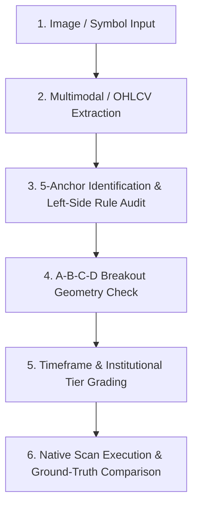

# 📊 Datta Price Action Validation Skill

This skill guides the agent in forensically auditing, validating, and backtesting price action trading setups against **Mr. Datta's Price Action Rulebook** (`G:\Poovendan\AI\Trading\Share\RefDoc\Chart\Datta`).

---

## 🎯 Core Validation Workflow

When tasked with analyzing a chart image, validating a symbol setup, or verifying scanner accuracy:



---

## 📐 Step-by-Step Validation Procedure

### Step 1: Chart Extraction & Coordinate Mapping
1. Extract or determine:
   - **Symbol / Asset Class**: Spot Equity, Index, or Option Contract (`CE`/`PE`).
   - **Timeframe**: `1W` (Weekly), `1D` (Daily), `60minute` (1h), `30minute`, `15minute`, or `3minute`.
   - **Visual Labels**: Look for handwritten tags: `L-1`, `L-2`, `H-1`, `H-2`, `A`, `B`, `C`, `D`, `BENCHMARK`, `SL`, `TARGET-1`, `MIN 3 SWING`.
   - **Price Levels**: Note exact horizontal price lines for Benchmark, Stop-Loss floor, and Target expansion.

### Step 2: Validate Anchor Pattern & Strict Rules
Audit the setup against the **10 Canonical Anchors**:

#### 🟢 Bullish Reversal Anchors:
1. **`find_anchor_ll_sweep` (Two Lower Lows / LL Sweep)**:
   - $L_1$ and $L_2$ pivot lows where $L_2 < L_1$.
   - **Schematic Rule (Image 22)**: $L_2$ candle **MUST BE RED** (showing downward liquidity sweep followed by sharp absorption).
   - **Gap Rule**: $\ge 3$ candles between $L_1$ and $L_2$ (`"NEED MORE THAN 2 CANDLES"`).
   - **Floor Protection**: No subsequent candle close breaks below $L_2$ low (`"NEXT NOT BREAK LOW-2"`).
2. **`find_anchor_bullish_engulfing`**: Bullish candle completely wraps prior candle's body & wicks.
3. **`find_anchor_hammer_baby`**: Small top body with lower shadow $\ge 2\times$ body length.
4. **`find_anchor_bullish_harami`**: Small body fully inside prior mother candle.
5. **`find_anchor_two_higher_highs`**: Two consecutive higher highs with green close.

#### 🔴 Bearish Reversal Anchors:
1. **`find_anchor_hh_sweep` (Two Higher Highs / HH Sweep)**:
   - $H_1$ and $H_2$ pivot highs where $H_2 > H_1$.
   - **Schematic Rule (Image 23)**: $H_2$ candle **MUST BE GREEN** (upward liquidity run rejected).
   - **Ceiling Protection**: No subsequent candle close breaks above $H_2$ high (`"ALL PRICE CLOSE BELOW HIGH OF H-2"`).
2. **`find_anchor_bearish_engulfing`**: Bearish candle completely engulfs prior green candle.
3. **`find_anchor_shooting_star_baby`**: Small bottom body with upper shadow $\ge 2\times$ body length.
4. **`find_anchor_bearish_harami`**: Small inside body contained in prior mother candle.
5. **`find_anchor_two_lower_lows`**: Two consecutive lower lows with red close.

---

### Step 3: A-B-C-D Breakout Geometry Verification
Verify the sequential progression:
* **Point A (Anchor)**: The confirmed reversal candle or liquidity sweep base.
* **Point B (Benchmark High / Low)**: The initial expansion extreme following Point A.
* **Point C (Retracement / Higher Low)**: Pullback into support without violating Anchor SL floor (Left-Side Rule).
* **Point D (Breakout Trigger)**: Candle breaking and closing beyond Point B level.
  * **80% Early D Entry**: Validated at Minute 24 of a 30m candle if price is beyond Point B and relative volume is $\ge 60\%$.

---

### Step 4: Timeframe-Aware Institutional Tier Classification

| Timeframe Category | Setup Type | Qualifying Criteria | Awarded Tier |
|---|---|---|:---:|
| **Daily / Weekly (`1D`, `1W`)** | Institutional Wyckoff Base | Multi-candle accumulation/distribution base (10–25 bars) + $R:R \ge 2.0$ | 🥇 **`TIER_1_GOLD`** |
| **Intraday Options (`15m`, `30m`)** | Parabolic Momentum Spike | 5 True Anchors + $\ge 3$ Swing Waves + Parabolic $R^2 \ge 0.55$ + $R:R \ge 2.0$ | 🥇 **`TIER_1_GOLD`** |
| **Any Timeframe** | Core Retracement Setup | Valid A-B-C-D geometry + $1.5 \le R:R < 2.0$ | 🥈 **`TIER_2_CORE`** |
| **Any Timeframe** | Momentum Fast Breakout | Valid Breakout + $1.2 \le R:R < 1.5$ | 🥉 **`TIER_3_MOMENTUM`** |

---

### Step 5: Executable Validation via Python CLI Helper

To test any symbol/date against the Datta Rulebook directly in the environment:

```powershell
python .agents/skills/datta-price-action-validator/scripts/validate_chart_setup.py --symbol TCS --date 2026-07-23 --tf day --side bull
```

---

## 📚 Detailed Reference Documentation

- [Datta 10-Anchor & B-C-D Matrix](./references/datta_rulebook_matrix.md)
- [Ground-Truth Chart Index (27 Charts)](./references/chart_ground_truth_index.md)
