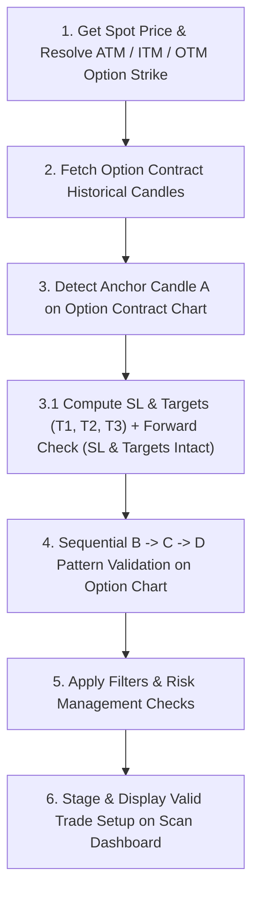

# FnO (Futures & Options) Strategy Scanning Workflow Specification

## Overview
This document specifies the complete execution flow for FnO option contract scanning, pattern detection, SL/Target pre-computation, forward-checking validation, and setup staging in the `Trade_Option` strategy engine.

---

## FnO Scanning Pipeline Architecture

---

## Detailed Step-by-Step Flow

### Step 1: Strike Resolution (Get ATM / Strike Range)
1. **Spot Price Identification**: Get the latest underlying index or stock spot price.
2. **Strike Selection**:
   - Calculate the At-The-Money (ATM) strike price based on `strike_step` (e.g., `round(spot / step) * step`).
   - If a `strike_range` parameter is configured (e.g. `STRIKE_RANGE = N`), evaluate ATM, ITM (-N steps), and OTM (+N steps) contracts.
3. **Expiry Selection**: Select the active near-month expiry contract (applying the 85% monthly rollover rule if within 4 days of contract expiry).

---

### Step 2: Fetch Option Contract Historical Candles
1. **Instrument Mapping**: Lookup the official Kite/NFO instrument token for the target option tradingsymbol (e.g., `SUNPHARMA26AUG1980CE`, `BANKNIFTY26AUG57700PE`).
2. **Historical Data Retrieval**: Fetch OHLCV candles **directly for the option contract chart** (`fetch_option_data`) across entry timeframe (`15minute` / `3minute`) and anchor timeframe (`30minute` / `60minute` / `15minute`).

---

### Step 3: Pattern A Detection & Immediate SL / Target Calculation
Scan the option contract candles for one of the 5 core Anchor (A-Formation) patterns:
- **`A1: Bullish Engulfing`**: Bullish option candle wrapping preceding bearish candle body.
- **`A2: LL Sweep (Low 2)`**: Option price dips below prior Low 1 and immediately recovers.
- **`A3: Hammer / Baby Candle`**: Small body candle with dominant lower wick inside mother candle body.
- **`A4: Bullish Harami`**: Inside bar green candle fully within preceding mother red candle.
- **`A5: Two Higher Highs`**: Two consecutive higher high bullish candles on the option chart.

#### Immediate SL & Targets Calculation at Anchor A
Upon finding Anchor A, the engine immediately pre-computes:
1. **Stop Loss (SL)**: $\text{SL} = \text{A.low} - \text{buffer}$ (calculated via `calculate_sl_buffer(A.low)`).
2. **Targets ($T_1, T_2, T_3$)**: Calculated via `find_profit_targets(df_anchor, A.high, stop_loss=SL)` using active, non-negated structural swing high pivots.

---

### Step 3.1: Forward Checking (SL & Targets Intact Validation)
Before attempting to find Point B, C, or D, the engine performs **Forward Checking** on all candles occurring *after* Anchor A (`after_a = df_entry.iloc[a_idx + 1 :]`):

1. **SL Intact Check**:
   $$\text{min}(\text{after\_a['close']}) > \text{SL}$$
   Discards Anchor A if any candle after A closed at or below Stop Loss.
2. **Target 1 Intact Check**:
   $$\text{max}(\text{after\_a['close']}) < T_1$$
   Discards Anchor A if any candle after A already reached or closed past Target 1 (prevents entering late/stale setups).
3. **Target 2 Intact Check**:
   $$\text{max}(\text{after\_a['close']}) < T_2$$
   Discards Anchor A if Target 2 was already reached.
4. **Anchor Timeframe Active Check (`is_anchor_valid_and_active`)**:
   Scans the anchor timeframe candles (`df_anchor`) after `candle_a_time` and invalidates the setup if any candle closed below SL or touched $T_1$.

---

### Step 4: Sequential B -> C -> D Breakout Scanning (On Option Contract Chart)
Only if Anchor A passes Forward Checking, scan for B $\rightarrow$ C $\rightarrow$ D:
1. **Point B (Breakout)**: First option candle closing above Anchor `A.high` (`Close > A.high`).
2. **Point C (Red Retest)**: First red option candle after B that dips/retests near `A.high` while holding above `SL` (`A.low - buffer`).
3. **Point D (Confirmation Close)**: First green option candle after C closing above `A.high` to confirm complete A -> B -> C -> D pattern.
4. **Intervening SL Check**: Verifies no candle between A and D closed below `SL`.

---

### Step 5: Setup Filtering & Risk Management
1. **Left-Side Rule**: Verify no option candle in the preceding lookback window (e.g., 100 bars) closed below `A.low`.
2. **No Post-A Breach (NoPA)**: Confirms no post-A breach occurred during pattern progression.
3. **Risk-Reward Filter**: Ensure $(T_{\text{avg}} - \text{Entry}) / (\text{Entry} - \text{SL}) \ge \text{Minimum\_RR}$ (e.g., RR $\ge 2.0$).
4. **Circuit & Liquidity Shield**: Verify option contract is not locked in upper/lower circuit limits.

---

### Step 6: Staging & Scan Dashboard Display
1. **Scan Display Output**: Write valid option trade setups to `output/monitor/scan_display_data.json` and `scan_display_index.json`.
2. **Scan Tab Rendering**: Display trade details:
   - Symbol & Contract (e.g., `VEDL26AUG265PE`)
   - Option Entry Price (`entry_spot`)
   - Stop Loss (`current_sl`)
   - Targets (`T1`, `T2`, `T3`)
   - Pattern & Timeframes
   - Risk/Reward Ratio
   - Execution Status (`Staged` / `Manual entry pending` / `Executed`)
3. **Engine Persisted Anchor Fields**: Each staged trade carries the engine's *confirmed* anchor levels so the chart never re-derives them from timestamps:
   - `benchmark` — breakout threshold = `A.high` for CE/BULL, `A.low` for PE/BEAR.
   - `anchor_floor` — sequence-integrity floor = `A.low` for BULL, `A.high` for BEAR.
   - `direction` — `"BULL"` or `"BEAR"`.
   These fields flow: scanner (`scan_anchor_bcd_breakout` / `_bearish`) → `scan_symbol` → `write_scan_display_data.build_trade` → staged JSON → dashboard chart modal. Engine position dicts (KITE_RECOVERED included) also persist them.

### Step 6.1: Chart Modal Rendering (A-B-C-D Markers & Benchmark Entry Line)
The `📈 Chart` button on both Scan and Positions tabs opens `openChartModal`, which renders on the option contract chart:
1. **Entry Price Line**: Drawn at the engine-persisted `benchmark` (label `Entry (A.high)` / `Entry (A.low)`), **not** at D's close. Falls back to `entry_spot` only when the benchmark is absent (legacy data).
2. **Benchmark-Based Risk Math**: SL% (on the SL line), T1 RR (on the T1 line), and footer R:R are all computed against the benchmark, not the actual entry.
3. **Direction-Aware Sequence Markers** (mirrors the engine, BULL vs BEAR):
   - `B` = first candle after A closing beyond the benchmark (BULL: `Close > A.high`; BEAR: `Close < A.low`).
   - `C` = first red retest candle after B dipping back to/near the benchmark while holding the anchor_floor (BULL: `Low <= A.high && Close > A.low`; BEAR: `High >= A.low && Close < A.high`).
   - `D` = first candle after C confirming back beyond the benchmark (BULL: `Close > A.high`; BEAR: red `Close < A.low`).
   - `⚠ Seq broken` red marker: any candle between A and D closed through the anchor_floor (BULL: `Close < A.low`; BEAR: `Close > A.high`).
4. **Timestamp Parsing**: `parseDateToUnix` parses `YYYY-MM-DD` as year/month/day (never swaps day and year, which previously produced 2009 epochs and no markers).

---

## System Safeguards & Bug Prevention Guidelines

To prevent recurring bugs during strategy scans, position monitoring, and UI display, the engine enforces 4 mandatory system safeguards:

### 1. Target & SL Sanity Guard ($T_1 > \text{Entry}$)
- **Rule**: For Call Options (`CE`) and long positions, Target 1 ($T_1$) **MUST BE STRICTLY GREATER** than the Option Entry Price ($T_1 > \text{Entry}$), and Stop Loss **MUST BE STRICTLY LESS** than Entry Price ($\text{SL} < \text{Entry}$).
- **Prevention**: Reject overrides or derived targets where $T_1 \le \text{Entry}$ (e.g., $T_1 = 5.25 \le 8.20$ inherited from another strike). Automatically re-derive clean target levels relative to entry price.

### 2. Strict Exact Contract Key Matching (No Partial Substring Matching)
- **Rule**: Contract overrides and database lookups **MUST MATCH EXACT CONTRACT TRADINGSYMBOLS** (`clean_k == clean_c`).
- **Prevention**: Partial substring matching (e.g. `POWERGRID` matching `POWERGRID 290 CE` instead of `POWERGRID 280 CE`) is strictly forbidden to prevent strike-level target pollution.

### 3. Active-Positions-Only DB Mapping (`write_scan_display_data`)
- **Rule**: When merging `trade_db` records into dashboard display files (`scan_display_data.json` / `scan_display_index.json`), `db_map` **MUST ONLY MAP ACTIVE/OPEN POSITIONS** (`status in ["ACTIVE", "OPEN"]`).
- **Prevention**: Closed or historical trades (`SL_HIT`, `TARGET_HIT`) must never overwrite freshly scanned option SL and Target prices on the Scan Tab.

### 4. Daily Session Candle Alignment (`resample_timeframe`)
- **Rule**: Intra-day timeframe resampling (e.g., `75min`) **MUST BE GROUPED BY TRADING DAY** (`trade_date`).
- **Prevention**: Grouping by trading session date ensures every 75-minute candle starts cleanly at market open (**`09:15 AM`**), preventing artificial pre-market timestamp shifts (`08:30 AM` / `08:45 AM`).

### 5. Engine Benchmark Persistence (Never Re-Derive Anchor Levels in the UI)
- **Rule**: The chart modal MUST use the engine-persisted `benchmark` / `anchor_floor` / `direction` for the Entry line and A-B-C-D markers. It MUST NOT re-derive `A.high`/`A.low` from `candle_a_time`.
- **Prevention**: Anchor detectors return different `CandleATime` than the engine's actual anchor index (`find_anchor_ll_sweep` returns the sweep candle at `df.iloc[-4]`, but the engine benchmark is `A.high` at `a_idx`). For setups like `ITC26AUG290PE` the sweep candle was an outlier (H=9.9), so timestamp-based re-derivation produced a wrong benchmark and B could never be found even though the engine confirmed a full A->B->C->D sequence. The engine's confirmed benchmark is the single source of truth.
