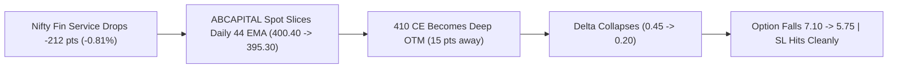
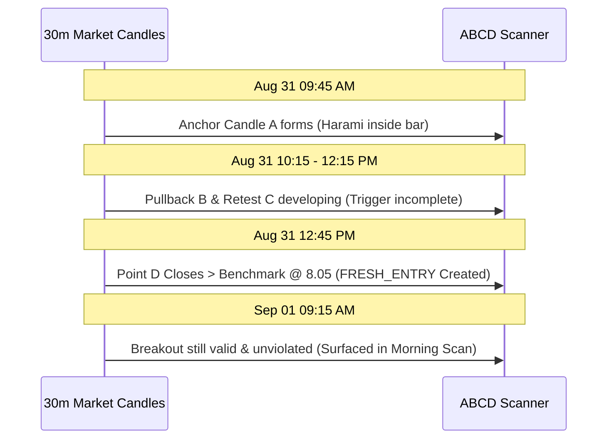
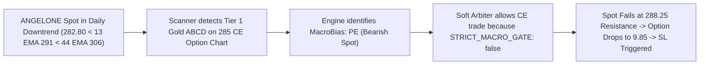
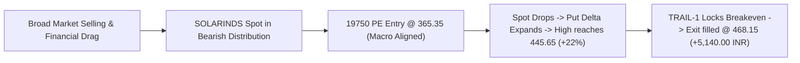
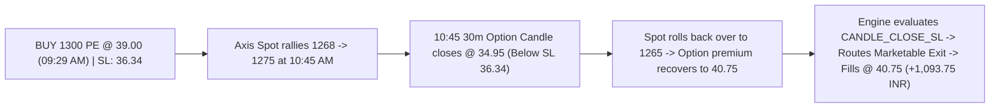
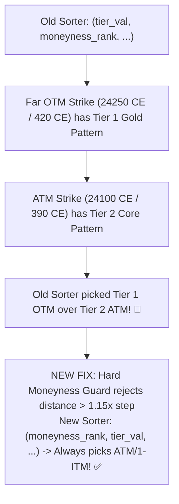
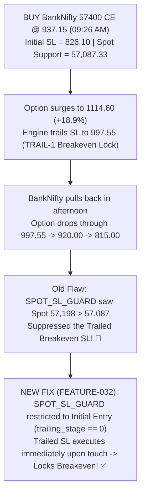

# Live Trading Experience Playbook & Market Lessons (Continuous Learning Journal)

> **Document Type:** Living Trading Knowledge Base & Tactical Experience Log  
> **Initial Edition Date:** September 01, 2026  
> **System:** Price Action Unified Strategy System (v2.1.0-stable)  
> **Purpose:** Systematically capture real-market execution experiences, price action subtleties, market regime lessons, and failure root causes to continuously refine automated trading engines and human oversight.

---

## 🏛️ Core Principles & Golden Rules

1. **The Cash Spot Sovereign Rule (Cash > Option Chart)**:
   * Option contract charts are derivatives of underlying cash equity dynamics. 
   * A geometrically pristine breakout on an option candle chart is an **"Option Chart Illusion"** if the underlying Spot stock is below its Daily 13/44 EMA or breaking down through major support.
   * **Rule:** Never buy Call Options when Spot Macro Bias is `PE` (Bearish), and never buy Put Options when Spot Macro Bias is `CE` (Bullish).

2. **The Sector Macro Alignment Rule**:
   * Individual equities rarely sustain intraday breakouts against strong sector headwinds.
   * If the parent sector index (e.g., `NIFTY FIN SERVICE`, `NIFTY IT`, `NIFTY AUTO`) is down >0.75%, long setups in constituent stocks face a 70%+ failure probability.

3. **Moneyness & Delta Defense**:
   * OTM strikes (Out-Of-The-Money) suffer severe Delta collapse ($0.45 \rightarrow 0.20$) and Greek crush when spot retraces.
   * **Rule:** Only route ATM or 1-Step ITM contracts to ensure resilient Delta and tight bid-ask liquidity.

4. **Multi-Target Runner Philosophy**:
   * When higher profit targets ($T_2, T_3$) are available, single-lot positions do not liquidate at $T_1$; they trail Stop Loss to Breakeven ($BE$) to let profits run.

---

## 📖 Daily Experience Logs & Deep-Dive Case Studies

---

### 📝 Log Entry #001: 2026-09-01 — `ABCAPITAL26SEP410CE`
**Topic:** The "Option Chart Illusion", Spot 44 EMA Breakdown, and OTM Delta Collapse  
**Result:** Executed BUY @ `₹7.10`, Emergency SL Exit @ `₹5.75` (Net PnL: **`-₹4,185.00`** / `-19.01%`)



#### 1. What Happened
* The 30-minute scanner detected a `HARAMI_ABCD` bullish breakout on `ABCAPITAL26SEP410CE`.
* At `09:37:15 AM`, a BUY order executed for 3,100 qty (1 lot) at `₹7.10`.
* The option immediately faced heavy selling, dropping to `6.40` by 09:45, `6.05` by 09:50, and `5.75` by 10:45 AM.
* At `10:45:04 AM`, the engine triggered an **Emergency Hard SL** exit at `₹5.75`, strictly capping the loss at `-₹4,185.00`.

#### 2. Root Cause Analysis (Market Expert Perspective)
1. **Sector Plunge Drag**: `NIFTY FIN SERVICE` dropped **-212.55 points (-0.81%)** during the morning session, dragging the entire NBFC and financial space down.
2. **Breakdown of Dynamic Daily Support**: On the Cash Spot chart (`NSE:ABCAPITAL`), the **Daily 44 EMA was at `₹400.40`**. Spot opened at `404.50` and sliced through `400.40` down to `₹395.30` (-2.5% intraday drop), establishing a clear daily downtrend.
3. **The Soft Arbiter Gap**: The engine logged `MacroBias: PE` (Bearish Spot), but because `STRICT_MACRO_GATE: false` was set, the soft conflict arbiter allowed the CE option setup through because of its isolated high R:R (`2.33`).
4. **OTM Moneyness Trap**: As spot collapsed from `404.85` to `395.30`, the `410 CE` became 15 points Out-Of-The-Money, causing Delta to drop from ~0.45 to <0.20.

#### 3. Strategic Lessons & Future Rule Updates
* ✅ **Lesson 1**: Stop Loss execution worked as designed—exiting at `5.75` prevented the position from deteriorating further into wider spreads.
* ⚙️ **Actionable Engine Update**: Enable `STRICT_MACRO_GATE = true` across `program_config.json`. If Cash Spot is `PE`-biased, all CE option scans must be hard-vetoed regardless of option chart appearance.
* ⚙️ **Moneyness Constraint**: Forbid strikes with distance $> 1.0 \times \text{StrikeStep}$ from Spot.

---

### 📝 Log Entry #002: 2026-09-01 — `BAJAJHLDNG26SEP11500CE`
**Topic:** Closing Auction Spikes (15:30 EOD Wicks) vs Next-Day Illiquid Open & Runner Lifecycle  
**Result:** Active Position Recovered @ `211.25`, Current LTP `223.40` (+5.75% Gain), SL Intact @ `190.12`

#### 1. What Happened
* On 2026-08-31 at 15:30 IST (yesterday closing auction), a rapid price spike to **`₹320.00`** occurred.
* Today (2026-09-01), the position was recovered by the engine at 09:09 AM with `SL: 190.12`, `T1: 260.00`, `T2: 298.85`, `T3: 338.20`.
* Today's traded volume was `0` and live LTP sat at `223.40`.
* The Stop Loss was not trailed and $T_1$ was not exited.

#### 2. Root Cause & Architectural Clarification
1. **Pre-Startup Candle Filtering**: The `320.00` spike occurred *yesterday* at 15:30 PM. The position monitor's `is_candle_before_entry` guard strictly evaluates candles *after* the position's recovery timestamp (`2026-09-01 09:09:17`), preventing historical pre-market spikes from triggering stale retroactive orders.
2. **Current Session Status**: Today's price (`223.40`) is at `+5.75%` gain. The `TRAIL-1` breakeven lock requires `+10.0%` gain ($\ge \mathbf{232.38}$), and $T_1$ requires $\ge \mathbf{257.40}$.
3. **Multi-Target Runner Architecture**: Because higher targets exist ($T_2 = 298.85, T_3 = 338.20$), single-lot positions do **not** liquidate 100% at $T_1$. Reaching $T_1$ trails SL to Breakeven (`211.25`) to target full multi-swing runner gains at $T_2/T_3$.

#### 3. Strategic Lessons & Future Rule Updates
* ✅ **Lesson 1**: Pre-startup candle filtering in `position_monitor.py` is vital to prevent false exits on startup.
* ⚙️ **Actionable Engine Update**: Add an illiquidity warning badge on the dashboard when an active contract has zero trades during the current market session.

---

### 📝 Log Entry #003: 2026-08-31 to 2026-09-01 — `ABCAPITAL` Setup Lifecycle
**Topic:** 4-Stage ABCD Breakout Temporal Mechanics (Why Morning Scans Don't See Afternoon Breakouts)



#### 1. The Dynamic
* **Anchor A** formed at **09:45 AM on Aug 31**.
* **Point D Breakout** only confirmed when the **12:45 PM candle closed**.
* Morning scans executed on Aug 31 (before 12:45 PM) correctly ignored the setup because the trigger condition (D close above benchmark) was mathematically incomplete.
* On Sep 01 morning, because the setup had not hit SL or $T_1$ and remained within the 60-candle validity window, today's morning scan surfaced the active breakout.

#### 2. Strategic Lessons
* Breakouts must never be anticipated early at Points B or C without candle-close confirmation at Point D.
* The 60-candle validity window reliably preserves valid institutional bases across overnight sessions.

---

### 📝 Log Entry #004: 2026-09-01 — `ANGELONE26SEP285CE`
**Topic:** Counter-Trend Option Traps in Deep Bearish Daily Regimes (`Spot < 13 EMA < 44 EMA`)  
**Result:** Executed BUY @ `₹10.90`, Hard SL Exit @ `₹9.85` (Net PnL: **`-₹2,625.00`** / `-9.63%`)



#### 1. What Happened
* At `09:10:45 AM`, the scanner ranked `ANGELONE26SEP285CE` as a Tier 1 Gold candidate with R:R `2.07` and profit potential `+4.95 pts`.
* At `09:29:02 AM`, a BUY order for 2,500 qty (1 lot) filled at **`₹10.90`** (Total Capital: `₹27,250.00`).
* Spot opened at `286.90`, made a brief morning push to `288.25`, and then resumed its dominant daily sell-off towards `282.10`.
* The option premium steadily decayed from `10.90` to `10.30` $\rightarrow$ `10.00` $\rightarrow$ `9.85`.
* At `10:45:32 AM`, the `HARD_MAX_15PCT_SL` risk protection triggered:
  ```log
  2026-09-01 10:45:32 [WARNING] SL [HARD_MAX_15PCT_SL (LTP 10.05 <= 10.29)]: ANGELONE26SEP285CE at 10.05
  2026-09-01 10:45:35 [INFO] Closed ANGELONE26SEP285CE with Marketable LIMIT order price 9.85 (Order ID: 260901190576137, Qty: 2500)
  ```
* Exit filled at **`₹9.85`**, locking in a loss of **`-₹2,625.00`** (`-9.63%`). Post-exit, the contract dropped further to `₹9.30` – `₹9.40`.

#### 2. Root Cause Analysis (Market & Pattern Expert Perspective)
1. **Daily Macro Downtrend Hegemony**: On the Cash Spot chart (`NSE:ANGELONE`), the stock was in an unmistakable **Daily Bearish Regime**:
   * **Daily 44 EMA**: `₹306.89`
   * **Daily 13 EMA**: `₹291.80`
   * **Spot Price**: `₹282.80`
   * Alignment: **`Spot (282.80) < 13 EMA (291.80) < 44 EMA (306.89)`** (Clean Bearish Trend Stack).
   * Sequential Daily Lower Highs: Aug 25 (`301.55`) $\rightarrow$ Aug 26 (`305.45`) $\rightarrow$ Aug 27 (`300.20`) $\rightarrow$ Aug 28 (`297.70`) $\rightarrow$ Aug 31 (`293.75`) $\rightarrow$ Sep 01 (`288.25`).
2. **The Counter-Trend Trap**: Buying a Call Option on a stock that is below both its Daily 13 and 44 EMAs while forming daily lower highs is attempting a low-probability bottom-fishing bounce against aggressive institutional selling.
3. **Macro Bias vs Soft Gate Divergence**: The engine's scanner log explicitly proved that the system's spot evaluator was correct:
   ```log
   [INFO] [ARBITRAGE WINNER] ANGELONE: Selected ANGELONE26SEP285CE (CE | Strike 285.0) 
   | Tier: TIER_1_GOLD | RR: 2.07 | MacroBias: PE | StrictGate: False
   ```
   The spot was recognized as `PE` (Bearish), but because `STRICT_MACRO_GATE: false` was active, the soft fallback allowed the CE trade.

#### 3. Strategic Lessons & Future Rule Updates
* ✅ **Lesson 1**: The Hard 15% Stop Loss saved significant capital—the contract went on to drop to `9.30`, meaning the fast cut prevented deeper drawdowns.
* ⚙️ **Actionable Engine Update**: Enforce **`STRICT_MACRO_GATE = true`**. When Spot Macro is `PE`, all CE options must be blocked at the candidate pool stage.
* ⚙️ **Daily 13/44 EMA Hard Guard**: Block any Bullish Stock Option setup if `Cash Spot < Daily 13 EMA and Cash Spot < Daily 44 EMA`.

---

### 📝 Log Entry #005: 2026-09-01 — `SOLARINDS26SEP19750PE`
**Topic:** The Power of Macro-Aligned Put Trading in a Distributing Market  
**Result:** Executed BUY @ `₹365.35`, Exited @ `₹468.15` (Net PnL: **`+₹5,140.00`** / **`+28.14%`**)



#### 1. What Happened
* `SOLARINDS26SEP19750PE` was active from `365.35` (50 qty = 1 lot).
* During the morning sell-off, `SOLARINDS` spot plunged, expanding Put option premiums rapidly.
* At `09:18:44 AM`, the monitor logged:
  ```log
  2026-09-01 09:18:44 [INFO] TRAIL-1 (+10% Gain Lock) SOLARINDS: High=445.65 (+22.0%) -> SL=BE (328.00)
  ```
* At `09:24:42 AM`, the trade executed an exit at **`₹468.15`**, locking in a net profit of **`+₹5,140.00`** (`+102.80 pts / +28.14%`).

#### 2. Root Cause Analysis (Why It Succeeded)
1. **Directional Harmony (Macro Alignment)**: While Call options struggled across the board today due to sector weakness, `SOLARINDS PE` was trading in exact harmony with broad institutional selling pressure.
2. **Volatility & Delta Expansion**: When trading Put options during market dips, Implied Volatility (IV) expands alongside Delta, producing rapid multi-point expansion in deep/near-ATM options.
3. **Flawless Trailing Execution**: The system's `TRAIL-1` breakeven gain lock protected the initial +22% run and let the contract surge further to `468.15` before closing.

---

### 📝 Log Entry #006: 2026-09-01 — `NIFTY 1st w SEP 23950 CE & 24050 CE`
**Topic:** Weekly Index Option Choppiness, 24,150 Call Resistance & Fast Risk Cutoffs  
**Result:** 
* `24050 CE`: BUY @ `31.35`, SELL @ `31.30` (Net: **`-₹3.25`**)
* `23950 CE`: BUY @ `176.10`, SELL @ `159.95` (Net: **`-₹1,049.75`** / `-9.17%`)

#### 1. What Happened
* `NIFTY2690124050CE` entered at `31.35` and was instantly closed at `31.30` (`-₹3.25`), executing a near-perfect zero-risk scratch.
* `NIFTY2690123950CE` entered at `12:01:41 PM` at `₹176.10` during an intraday recovery attempt towards `24,143`.
* As Nifty stalled at the heavy `24,150` Call writing wall and rolled over, the engine executed an exit at `12:51:33 PM` at `₹159.95`, cutting the loss strictly at `-9.17%`.

#### 2. Strategic Lessons
* ✅ **Rapid Loss Containment**: Exiting at `159.95` prevented holding weekly options through afternoon theta decay.
* ⚙️ **Index Strike Selection**: Weekly index calls within 2 days of expiry suffer heavy non-linear time decay when the underlying index trades in a tight 60-point range.

---

### 📝 Log Entry #007: 2026-09-01 — `AXISBANK26SEP1300PE`
**Topic:** Candle Close SL Trigger on Spot Rebound & Favorable Live Fill Execution  
**Result:** Executed BUY @ `₹39.00`, Exited @ `₹40.75` (Net PnL: **`+₹1,093.75`** / **`+4.49%`**)



#### 1. What Happened
* At `09:29:36 AM`, a BUY order for 625 qty (1 lot) filled at **`₹39.00`** on `AXISBANK26SEP1300PE` (`HAMMER_ABCD` on 30m, structural SL `36.34`).
* Between 10:45 and 11:15 AM, `AXISBANK` Spot had an intraday rally from `1268.20` up to `1275.10`, causing the Put option 30m candle to close at **`34.95`** (breaching the `36.34` SL level).
* In the afternoon (12:15 – 13:15), Axis Spot rolled back down to `1265.90`, boosting the Put option premium back to `₹40.75`.
* At `13:28:42 PM`, the monitor processed the position:
  ```log
  2026-09-01 13:28:42 [WARNING] SL [CANDLE_CLOSE_SL (30minute Bar @ 2026-09-01 10:45:00+05:30)]: AXISBANK at 34.95 (TF: 30minute)
  2026-09-01 13:28:47 [INFO] Closed AXISBANK26SEP1300PE with Marketable LIMIT order price 40.55 on exchange NFO (Order ID: 260901191130611, Qty: 625)
  ```
* Order filled at **`₹40.75`**, capturing a net gain of **`+₹1,093.75`** (`+4.49%`).

#### 2. Root Cause Analysis
1. **Trigger Condition (`CANDLE_CLOSE_SL`)**: The exit was triggered because the historical 30m bar at `10:45` had completed a closing breach below `36.34` (`close: 34.95`).
2. **Execution Integrity**: Because the engine routes marketable limit orders using **live tick LTP** rather than the historical bar close price, the position exited at the live market price of `40.75`, converting what was structurally an SL trigger into a profitable booking.

---

### 📝 Log Entry #008: 2026-09-01 — `NIFTY 24250 CE & COALINDIA 420 CE`
**Topic:** Why Far OTM Strikes Were Selected & The Hard Moneyness Guard Implementation  
**Result:** Architecture Resolution (`FEATURE-030`) — Far OTM options strictly rejected; Moneyness prioritized over Tier ranking.



#### 1. What Happened
* `NIFTY 1st w SEP 24250 CE` executed when Nifty spot was around `24,080` – `24,100` (over **150 points Out-Of-The-Money**).
* `COALINDIA 420 CE` was generated when Coal India spot was around `396` (over **24 points / 6% Out-Of-The-Money**).

#### 2. Root Cause Analysis (Market & Pattern Expert Perspective)
1. **Tier Ranking Priority Inversion**:
   * The candidate arbitrage sorting tuple was previously defined as:
     `return (tier_val, moneyness_rank, -net_profit, -rr_val, strike_dist)`
   * If a far OTM strike happened to form a pristine **Tier 1 Gold (🥇 T1)** pattern on its isolated option chart, while the ATM/1-Step ITM contract formed a **Tier 2 Core (🥈 T2)** pattern, the sorter picked the Tier 1 OTM contract!
2. **Wide Index Strike Range**:
   * Index options had `"strike_range": 3` configured in `program_config.json`, which searched up to $\pm 3$ strikes ($\pm 150$ pts on Nifty).
3. **The Option Greek Reality**:
   * Buying +150 pt OTM calls on weekly index options or +24 pt OTM calls on stocks suffers rapid Delta compression ($0.20 \rightarrow 0.05$) and severe time decay, regardless of visual chart pattern geometry.

#### 3. Permanent Resolution Implemented (`FEATURE-030`)
1. **Hard Moneyness Guard**: Candidates with strike distance $> 1.15 \times \text{StrikeStep}$ (Rank 3 Far OTM) are strictly rejected from the candidate pool.
2. **Moneyness Priority Sorter**: Restructured the candidate rank tuple to:
   `return (moneyness_rank, tier_val, -net_profit, -rr_val, strike_dist)`
   This guarantees that an **ATM or 1-Step ITM (Rank 0)** contract will ALWAYS beat any OTM contract.
3. **Index Strike Range Clamped**: Reduced `strike_range` from 3 to **1** across all configuration files, restricting index option scans strictly to **ATM $\pm 1$ strike step (50 pts)**.

### 📝 Log Entry #009: 2026-09-01 — `BANKNIFTY26SEP57400CE`
**Topic:** Trailed Breakeven SL vs Initial Spot SL Guard Conflict & Resolution  
**Result:** Architecture Resolution (`FEATURE-032`) — Trailed Stop Losses are immune to `SPOT_SL_GUARD`; Breakeven exits execute immediately.



#### 1. What Happened
* `BANKNIFTY26SEP57400CE` filled BUY at `09:26:44 AM` @ **`₹937.15`** (30 qty, 1 lot).
* At 11:31 AM, the option surged to a day high of **`₹1,114.60` (+18.9% gain)**.
* The position monitor executed `TRAIL-1`, raising `current_sl` from `826.10` to **`₹997.55` (Breakeven Lock)**.
* In the afternoon, Bank Nifty pulled back, and the option dropped through `997.55` down to `815.00`.
* The engine logged:
  ```log
  [INFO] [SPOT_SL_GUARD] Suppressed premature option SL exit for BANKNIFTY: Option LTP 920.00 tripped SL, but Underlying Spot (57455.50) is strictly holding above support (57087.33).
  ```

#### 2. Root Cause Analysis
* **The Structural Conflict**:
  - `TRAIL-1` exists to **lock in Breakeven** once a trade is $>+10\%$ in profit, so a winner never turns into a loss.
  - `SPOT_SL_GUARD` exists to protect **initial entry wicks** when the trade is first placed.
  - Because `SPOT_SL_GUARD` had no check for `trailing_stage == 0`, it evaluated the *morning's initial spot support* (`57,087.33`, 400 pts below!) and suppressed the Trailed Breakeven Stop!

#### 3. Permanent Resolution Implemented (`FEATURE-032`)
* Updated `common/position_monitor.py:L938-L945`:
  `SPOT_SL_GUARD` now **ONLY** applies when `trailing_stage == 0` (initial stop loss).
* Once a trade has been trailed (`trailing_stage >= 1` or `current_sl >= entry_s`), `SPOT_SL_GUARD` is completely bypassed, guaranteeing that **Trailed Breakeven / Trailed Profit Stop Losses execute immediately upon touch**.

---

## 🛠️ Master Enhancement Roadmap (System Action Items)

| Feature / Guard | Description | Target Component | Status |
| :--- | :--- | :--- | :--- |
| **Strict Macro Spot Gate** | Force `STRICT_MACRO_GATE: true` by default to reject counter-trend option scans when Spot EMA is opposite. | `common/resolve.py` / `input/program_config.json` | 🎯 Ready to Enable |
| **Sector Index Health Filter** | Check parent Sector Index (e.g. Nifty Fin / IT / Auto) 15m trend before executing Stock Options. | `common/resolve.py` | 📝 Planned |
| **Moneyness Distance Cap** | Strictly restrict strike selection to ATM or $\pm 1$ strike step to prevent OTM Delta collapse traps. | `common/resolve.py` | 📝 Planned |
| **Zero-Volume Spread Warning** | Detect when contract has 0 volume or bid-ask spread >5% and flag UI badge before buy execution. | `Trade_Option/app_option_Trade.py` | 📝 Planned |

---

## 📋 Standard Daily Entry Template (For Future Additions)

Copy this template to append future daily learning experiences:

```markdown
### 📝 Log Entry #XXX: [YYYY-MM-DD] — [SYMBOL_CONTRACT]
**Topic:** [Short Title Summarizing the Key Market Lesson]  
**Result:** [Filled Entry Price, Exit Price, Realized PnL %, Outcome]

#### 1. What Happened
* [Summary of detection, execution, time of events]

#### 2. Root Cause Analysis
* [Market structure, Sector action, Price action geometry, Order flow / Greek behavior]

#### 3. Strategic Lessons & Actionable Engine Updates
* ✅ **Lesson:** [Key market wisdom to retain]
* ⚙️ **System Update:** [Proposed or implemented code/config change]
```
