# 🏛️ Price Action Strategy — Master System Architecture & Operational Flow Manual

> **System Version**: `v2.1.0-stable`  
> **Platform**: Indian Equities & F&O Algorithmic Trading Platform (Zerodha Kite)  
> **Target Subsystems**: `Trade_Option/` (Port 5050), `Trade_Stock/` (Port 5051), `common/`  
> **Documentation Date**: 2026-09-22  

---

## 1. Executive Summary & Dual-Engine Overview

The Price Action Trading platform runs two independent, decoupled trading engines that operate concurrently without process contention:

```
┌─────────────────────────────────────────────────────────────────────────────────────────────────┐
│                           PRICE ACTION TRADING SYSTEM (v2.1.0-STABLE)                           │
├──────────────────────────────────────────────┬──────────────────────────────────────────────────┤
│           OPTIONS ENGINE (Port 5050)         │             STOCK CASH ENGINE (Port 5051)        │
├──────────────────────────────────────────────┼──────────────────────────────────────────────────┤
│ • Primary: stock_options_trade_engine.py     │ • Primary: stock_reversal_scanner.py             │
│ • Primary: index_options_trade_engine.py     │ • App: app_Stock_Trade.py                        │
│ • Asset: Long Options Buying (CE & PE)       │ • Asset: Cash Equities (EQ)                      │
│ • Execution: Sub-15s Radar + 15m Discovery   │ • Mode: Long (CNC/MIS) & Short (MIS)             │
│ • Greeks: Non-linear Delta, Gamma, Theta     │ • Greeks: ZERO Greeks, ZERO Theta, 1.0 Delta     │
│ • Leverage: Embedded option premium leverage │ • Leverage: 5x Intraday MIS Leverage             │
│ • Universe: 210 F&O Equities + Major Indices │ • Universe: NIFTY 500 / Liquid Cash Equities     │
└──────────────────────────────────────────────┴──────────────────────────────────────────────────┘
```

---

## 2. End-to-End Trading Lifecycle Architecture

```mermaid
flowchart TD
    subgraph PHASE_1 ["Phase 1: Pre-Market Discovery & Staging (08:30 AM / EOD)"]
        A["210 F&O Equities / Nifty Universe"] --> B["Multi-TF Candlestick Geometry Scan<br/>(15m Anchor + 3m/5m Entry)"]
        B --> C{"10 Core Anchor Patterns Detected?<br/>(5 Bullish / 5 Bearish Anchors)"}
        C -- "YES" --> D["Calculate VCP Compression (ATR3/ATR14)<br/>& TTM Squeeze Detection"]
        D --> E["Stage into Pattern Funnel:<br/>• Category A+: Imminent Velocity (VCP ≤ 0.65)<br/>• Category A: Breakout Ready<br/>• Category B: Anchor Incubator"]
        E --> F["Write to scan_display.json & pattern_funnel.json"]
        F --> G["1-Click Sync: push_scans_to_vm.bat<br/>(Transfers to Cloud VMs in 3.5s without restart)"]
    end

    subgraph PHASE_2 ["Phase 2: Market Open Real-Time Surveillance (09:15 AM onwards)"]
        G --> H["15-Second Fast Radar Loop Awakens<br/>(Runs continuously on Cloud VM)"]
        H --> I["Quote-First Bulk Polling (150ms via kite.quote)"]
        I --> J{"Fast Pre-Entry Skips?<br/>• Already hit 80% T1? Evict<br/>• SL Breached? Skip candle fetch<br/>• LTP < 98% Benchmark? Skip"}
        J -- "Near Trigger" --> K{"Trigger Fired?<br/>1. Breakout: LTP ≥ Benchmark D (80% candle mature)<br/>2. Retest: BM × 0.98 ≤ LTP ≤ BM × 1.025"}
        K -- "YES" --> L{"Morning Surge Gate (09:15–10:30 IST):<br/>CE: Spot ≥ Spot VWAP?<br/>PE: Spot ≤ Spot VWAP?"}
    end

    subgraph PHASE_3 ["Phase 3: The 7 Master Execution Gates"]
        L -- "PASS" --> M["_avg_target_rank Composite Priority Score:<br/>Confluence (+2.0) | VCP (+1.5) | Discount (+0.5) | R:R (cap 5.0)"]
        M --> G1{"Gate 1: Mandatory Spot Confluence?<br/>(100% win/loss separation rule)"}
        G1 -- "NO" --> REJ1["❌ Skip Auto-Entry (Kept on Scans Tab)"]
        G1 -- "YES" --> G2{"Gate 2: Low-DTE Premium Floor?<br/>(Premium ≥ ₹5.00 if DTE ≤ 5)"}
        G2 -- "NO" --> REJ2["❌ Skip Lottery Ticket"]
        G2 -- "YES" --> G3{"Gate 3: Safe Option Value Corridor?<br/>(-5.0% ≤ Stretch ≤ +15.0% of VWAP)"}
        G3 -- "Stretched > 15%" --> REJ3["⏳ Wait for Retest (Avoid Peak Chase)"]
        G3 -- "Breakdown < -5%" --> REJ4["❌ Reject Falling Knife (IV Crush)"]
        G3 -- "Safe Value" --> G4{"Gate 4: India VIX Macro Gate?<br/>(T1 Gold allowed under VIX < 11.5)"}
        G4 -- "PASS" --> G5{"Gate 5: Portfolio Risk Caps?<br/>(Max 6 concurrent, Sector cap ≤ 2)"}
        G5 -- "PASS" --> G6["Gate 6: Adaptive Liquidity Spread Gate<br/>(Mid-Price Pegged Limit Routing)"]
        G6 --> G7["Gate 7: Kite LPP Safety Clamp<br/>(min(limit_price, LTP × 1.08))"]
        G7 --> EXEC["🎯 ORDER PLACED TO KITE API<br/>(Status = ACTIVE in SQLite & Memory)"]
    end

    subgraph PHASE_4 ["Phase 4: Active Position Management & Smart Ratchets"]
        EXEC --> PM["position_monitor.py Surveillance Loop"]
        PM --> S1{"Option breaches Nominal SL?<br/>Check Spot-Anchored SL Guard"}
        S1 -- "Spot holds Support" --> S1_SUP["🛡️ Suppress Exit! (Beats Market Maker Stop Hunts)<br/>Catastrophic Cap: Exit if loss ≥ 28%"]
        S1 -- "Spot breaks Support" --> S1_EXIT["🛑 Execute Stop-Loss Exit"]
        
        PM --> S2{"Target 1 Hit?"}
        S2 -- "≥ 2 Lots" --> S2_TR1["💰 Book 50% Profit (Tranche 1)<br/>🔒 Trail remaining SL to Positive Breakeven (+BE: Entry + 2%)"]
        
        PM --> S3{"Target 2 / 3 Hit?"}
        S3 -- "T2 Hit" --> S3_T2["Trail SL to T1"]
        S3 -- "T3 Hit" --> S3_T3["🎉 100% Full Profit Exit"]
    end
```



---

## 3. Core Architectural Subsystems

### 3.1 Pattern Geometry & Candlestick Analytics (`common/`)

The platform implements the Datta Price Action methodology based on **raw OHLCV candlestick geometry**:

- **5 Bullish Anchors**:
  1. `BE_ABCD` — Bullish Engulfing (candle body fully consumes prior red candle)
  2. `LL_ABCD` — Lower Low Liquidity Sweep (sweeps prior structural low, rejects, closes strong)
  3. `HAMMER_ABCD` — Hammer Baby (long lower rejection shadow $\ge 2\times$ body, upper wick $\le 10\%$)
  4. `HARAMI_ABCD` — Bullish Harami (inside bar resting in upper quadrant of prior mother candle)
  5. `HH_ABCD` — Two Higher Highs (momentum expansion with ascending volume)
- **5 Bearish Anchors**: Bearish Engulfing, HH Sweep, Shooting Star Baby, Bearish Harami, Two Lower Lows.
- **A-B-C-D Structure**:
  - **Point A (Anchor)**: The institutional volume footprint establishing the structural base.
  - **Point B (Pullback Peak)**: The initial impulse boundary (becomes Benchmark $D$).
  - **Point C (Retracement Low)**: Supply exhaustion higher low ($C > A$ for bullish).
  - **Point D (Breakout Trigger)**: Piercing of line $B$ with volume confirmation.

### 3.2 Volatility Contraction Pattern (VCP) Metrics
- **ATR Contraction Ratio**:
  $$\text{ATR Ratio} = \frac{ATR(3)}{ATR(14)}$$
- **VCP Classification**:
  - $ATR \le 0.65$: **VCP Coiled (Spring-loaded compression)** $\to$ Automatically promoted to **🥇 Tier 1 Gold**.
  - $ATR > 0.85$: Volatile / uncontracted noise $\to$ Relegated to Tier 2 Core or held.
- **TTM Squeeze**: Bollinger Bands (20, 2.0) contracting completely inside Keltner Channels (20, 1.5).

### 3.3 The Pattern Funnel (`common/pattern_funnel.py`)
Candidates are managed through a monotonic stage lifecycle:
- **Category B (Incubator)**: Anchor $A$ formed on anchor timeframe (15m/60m); $B$ and $C$ still developing.
- **Category A (Ready)**: $A-B-C$ fully formed, awaiting Point $D$ trigger.
- **Category A+ (Imminent)**: Multi-swing Wyckoff base ($\ge 2$ waves) + VCP Coiled ($ATR \le 0.65$) + resting at Benchmark $D$.

---

## 4. The 7 Master Execution Gates (`execute_highest_rr_trade`)

Every order—whether triggered by the 15-second Fast Radar or the 15-minute discovery scanner—must pass all 7 sequential gates:

| Gate # | Name | Verification Formula / Condition | Action on Failure |
|---|---|---|---|
| **Gate 1** | **Mandatory Spot Confluence** | $\text{Spot} \ge \text{Spot VWAP (CE)}$ or $\text{Spot} \le \text{Spot VWAP (PE)}$ | **Hard Reject**: Setup remains on Scans Tab; zero capital committed |
| **Gate 2** | **Low-DTE Premium Floor** | If $DTE \le 5$, $\text{Premium} \ge ₹5.00$ | **Hard Reject**: Eliminates sub-₹5 lottery options that bleed theta |
| **Gate 3** | **Safe Option Value Corridor** | $-5.0\% \le \text{Option VWAP Stretch} \le +15.0\%$ | • $> +15\%$: Wait for retest (avoids FOMO peak)<br/>• $< -5\%$: Reject falling knife (avoids IV crush) |
| **Gate 4** | **India VIX Macro Gate** | Compressed VIX ($< 11.5$): Only Tier 1 Gold allowed | Suppresses Tier 2 & 3 to prevent low-volatility theta chop |
| **Gate 5** | **Portfolio Risk Caps** | $\text{Active Scripts} < \text{Max Concurrent (6)}$<br/>$\text{Same Sector} \le 2$ | Skips candidate; maintains portfolio diversification |
| **Gate 6** | **Adaptive Liquidity Spread** | $\text{Bid-Ask Spread} \le 2.0\%$ (or $3.0\%$ for T1 Gold) | Skips illiquid strikes; routes mid-price pegged limit orders |
| **Gate 7** | **Kite LPP Safety Clamp** | $\text{Limit Price} = \min(\text{Limit}, \text{LTP} \times 1.08)$ | Clamps price to exchange Limit Price Protection boundaries |

---

## 5. Active Position Monitoring & Smart Ratchets (`position_monitor.py`)

### 5.1 Spot-Anchored Structural SL Guard
Option prices are frequently distorted by market maker bid-ask spread widening and temporary volatility spikes. 
- **The Guard**: When option premium touches nominal SL, the monitor checks the **Underlying Spot Price**:
  - For Calls: If Underlying Spot $> \text{Spot SL}$, the option exit is **suppressed**.
  - For Puts: If Underlying Spot $< \text{Spot SL}$, the option exit is **suppressed**.
- **Catastrophic Defense Cap**: If option premium falls $\ge 28\%$ from entry, exit triggers unconditionally regardless of spot.

### 5.2 Two-Tranche Target Management & Positive Breakeven (+BE Lock)
- **At Target 1 (T1)**:
  - If holding $\ge 2$ lots: Books **50% partial profit** (Tranche 1).
  - Automatically ratchets remaining runner stop-loss to **Positive Breakeven (+BE: Entry + 2%)**:
    $$\text{Trailed SL} = \text{Entry} + \max(\text{Buffer}, 0.5 \times ATR)$$
  - Advances `trailing_stage = 1`. A winning trade is mathematically prevented from becoming a loss.
- **At Target 2 (T2)**: Trails SL to T1 level (`trailing_stage = 2`).
- **At Target 3 (T3)**: Closes 100% full position for maximum expansion gain.

---

## 6. Hybrid Compute-Execution Architecture (Local + Cloud VM)

The system leverages the **Compute-Execution Split**:
- **Local Workstation (Heavy Compute)**: Scans 210 F&O stocks across multiple timeframes in ~2 minutes without server load.
- **Oracle Cloud VMs (Dedicated Low-Latency Execution)**: Runs 24/7 with zero CPU strain, dedicating 100% of its API quota to sub-15-second Fast Radar surveillance.

### 1-Click Sync Pipeline (`push_scans_to_vm.bat`)
```
[Local Workstation] ──(3.5s SCP Payload)──▶ [Oracle Cloud VMs (Bhavni & Poovendan)]
  • pattern_funnel.json                        • Extracted directly into output/monitor/
  • scan_display.json                          • ZERO SERVICE RESTARTS REQUIRED
  • scan_display_index.json                    • 15s Fast Radar reloads dynamically
                                               • Ready & armed for 09:15 AM open!
```

---

## 7. Daily Operational Checklist

| Time | Action | Tool / Command | Objective |
|---|---|---|---|
| **08:30 AM** | Generate Kite Access Token | `Kite_Access_Token_gen.py` | Fresh daily broker session |
| **08:35 AM** | Run Pre-Market Discovery Scan | Dashboard / Local CLI | Populate `pattern_funnel.json` & `scan_display.json` |
| **08:40 AM** | 1-Click Sync to Cloud VMs | Double-click `push_scans_to_vm.bat` | Arm Cloud VMs with Category A+ focus list |
| **09:00 AM** | Pre-Open Surveillance | Dashboard (Port 5050) | Review Category A+ Imminent setups on Radar Tab |
| **09:15 AM** | Market Open Auto-Execution | 15s Fast Radar Loop | Automatic execution upon Point D breakout with Confluence |
| **15:30 PM** | Post-Market EOD Audit | Dashboard Reports / Journal | Review P&L, slippage, and update journal logs |
