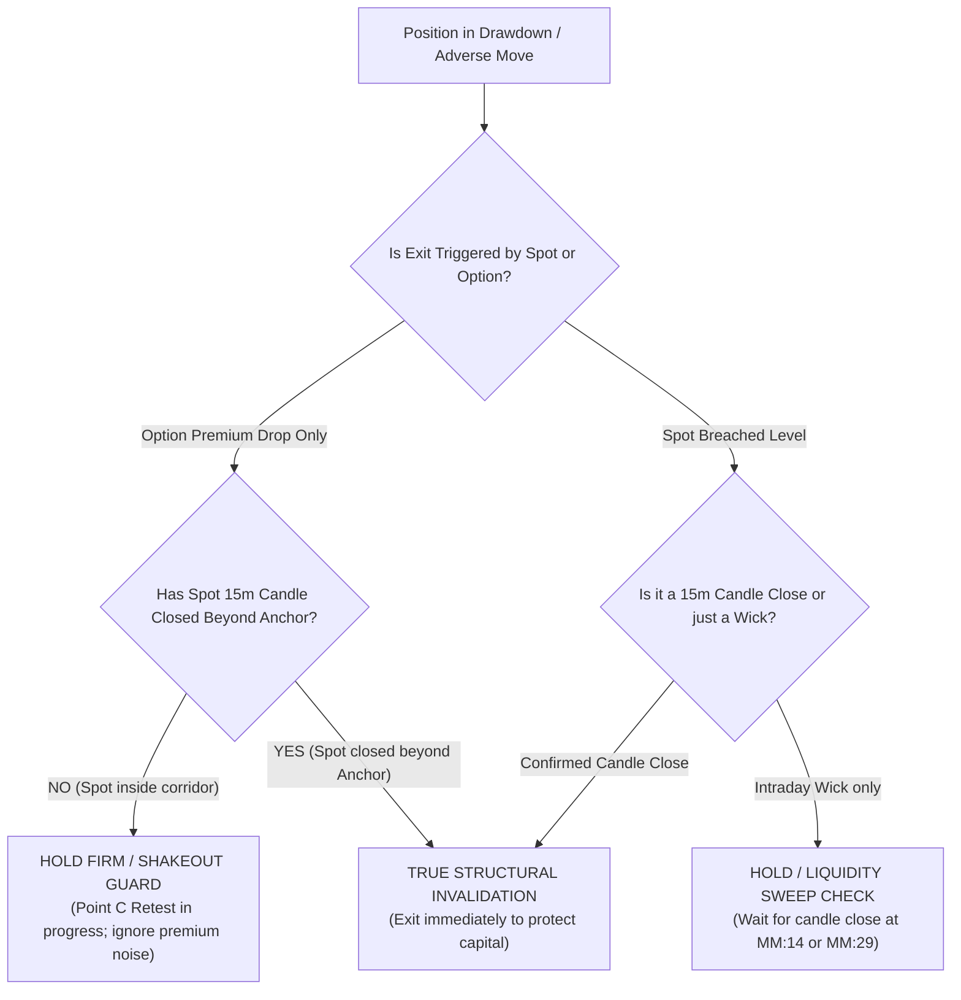
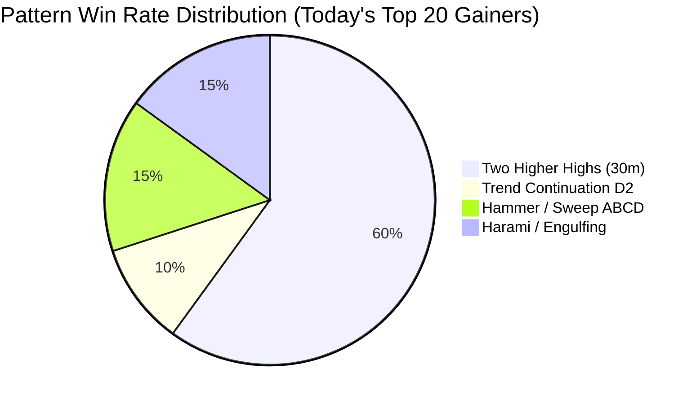

# 📓 Daily Algorithmic Trading & Strategy Learning Journal

This repository records daily trading logs, execution forensics, pattern performance audits, broker order realities, and strategic insights. It serves as our living feedback loop to review, discuss, and continuously improve the Price Action Strategy and automated execution engines.

---

## 📑 Table of Contents
- [Journal Format & Guidelines](#-journal-format--guidelines)
- [Session 2026-09-23: Forensic Loss Analysis, Margin Bottlenecks & Scanned List 50%+ Winners](#-session-2026-09-23-wednesday)
  - [1. Macro Market Context](#1-macro-market-context)
  - [2. Executed Trades & P&L Breakdown](#2-executed-trades--pl-breakdown-vm-1-account)
  - [3. Execution Reality & Critical Broker Margin Discovery](#3-execution-reality--critical-broker-margin-discovery)
  - [4. Scanned List Performance Audit (50%+ Winners)](#4-scanned-list-performance-audit-did-our-scanners-win)
  - [5. Forensic Case Study: POWERGRID OCT 265 CE (Manual Exit Audit)](#5-deep-forensic-case-study-powergrid-oct-265-ce--anatomy-of-a-premature-exit)
  - [6. Forensic Case Study: NAUKRI 1300 PE (Rebound Autopsy)](#6-deep-forensic-case-study-naukri-1300-pe--rebound-autopsy-did-we-buy-a-trap-or-exit-early)
  - [7. Structural Invalidation vs Morning Shakeout Decision Matrix](#7-structural-invalidation-vs-temporary-shakeout-the-geometric--quantitative-decision-matrix)
  - [8. Forensic Case Study: TMPV OCT 300 PE (Broken Spread & Dynamic Slot Swap)](#8-deep-forensic-case-study-tmpv-oct-300-pe--the-anatomy-of-a-broken-spread--dynamic-slot-swap)
  - [9. Pattern Alignment: What Worked vs What Failed](#9-pattern-alignment-what-worked-vs-what-failed)
  - [10. Strategic Directives & System Proposals](#10-strategic-directives--system-proposals-for-codebase)

---

## 📐 Journal Format & Guidelines

Each day's entry must document:
1. **Market Context & Regime**: NIFTY/BANKNIFTY direction, India VIX, sector rotations.
2. **Executed Trades & Account P&L**: Net P&L, win/loss breakdown, trade lifecycle events.
3. **Execution Reality & Broker Order Audit**: Margin checks, order rejections, tick sizes, fills, slippage.
4. **Scanned Universe Performance Audit**: Did candidates on our scan list trigger massive wins? Which ones?
5. **Pattern Effectiveness Matrix**: Which specific patterns (`Two Higher Highs`, `LL Sweep`, `Hammer`, `Engulfing`, `D2 Continuation`) delivered the highest win rate and edge?
6. **Key Actionable Lessons & Proposals for System Discussion**: Concrete code, configuration, or risk adjustments.

---

## 📅 Session: 2026-09-23 (Wednesday)

### 1. Macro Market Context
* **Regime**: Mildly bullish / consolidating near highs with strong sectoral rotation into Metals (`TATASTEEL`, `VEDL`, `JSWSTEEL`), Pharma (`DIVISLAB`), and Power (`ADANIPOWER`, `SUZLON`).
* **Opening Volatility**: High whipsaw during the opening 15 minutes (09:15 – 09:30 AM), particularly in midcaps and indices.

---

### 2. Executed Trades & P&L Breakdown (VM 1 Account)

* **Account Capital**: ₹61,584.60 Available Margin.
* **Net Realized P&L**: $-₹6,424.50$.
* **Active Open Positions**: `DIXON` (+₹2,000.00 / +8.16%), `SBICARD` (+₹400.00 / +2.50%), `CIPLA` (-₹1,062.50 / -9.09%).

| Symbol & Strike | Type | Entry | Exit | Net P&L | Return % | Outcome & Trade Reason |
|---|---|---|---|---|:---:|---|
| **`ASIANPAINT 2460 CE`** | Naked Long CE | ₹21.15 | ₹24.75 | **$+₹1,037.50$** | **$+19.62\%$** | 🏆 **Clean Win**. Point D breakout confirmation, Target T1 executed at 10:02 AM. |
| **`MIDCPNIFTY 14550 CE`** | Broken Spread $\to$ Naked CE | ₹106.90 | ₹88.80 | **$-₹2,172.00$** | $-16.93\%$ | ❌ **Opening 09:18 Whipsaw + Margin Rejection**. Leg 2 short rejected by RMS. Position unhedged; hit Stop-Loss. |
| **`NAUKRI 1300 PE / 1260 PE`** | Overnight Bearish PE | ₹14.80 | ₹8.35 | **$-₹3,217.50$** | $-43.50\%$ | ⚠️ **Premature Manual Exit**. Exited manually at bottom tick (₹8.35); spot collapsed to 1,297 and option exploded to ₹17.70 (+112%). |
| **`SENSEX 74700 CE`** | Scalp CE | ₹237.25 | ₹242.25 | **$+₹100.00$** | $+2.11\%$ | ⚡ **Quick Target Scalp**. Bought and exited with quick profit lock. |
| **`POWERGRID 265 CE`** | Naked Long CE | ₹7.50 | ₹7.70 | **$+₹380.00$** | **$+2.67\%$** | ⚠️ **Premature Winner Exit**. Manual exit at +₹380 (+2.67%); option later expanded to ₹9.50 (+26.6% / Target T1 hit). |
| **`ULTRACEMCO 11000 PE`**| Monthly Oct PE | ₹193.45 | ₹172.25 | **$-₹1,060.00$** | $-10.96\%$ | 🛡️ **Structural Invalidation Saved Loss**. Spot broke 11,100 resistance to 11,198; option plunged to ₹164.00. Exit saved capital! |
| **`TMPV 300 PE`** | Broken Bear Spread | ₹9.00 | ₹8.25 | **$-₹1,200.00$** | $-8.33\%$ | 🔄 **Dynamic Slot Swap Exit**. Automated engine evicted flat position after 154m to free slot for 🥇 Gold TATACONSUM (R:R 4.06). |
| **`DIXON 13000 CE`** | Monthly Oct CE | ₹490.00 | Open | **$+₹2,000.00$** | **$+8.16\%$** | ⏳ **Active Position**. Clean expansion wave, LTP ₹530.00. |
| **`SBICARD 640 CE`** | Monthly Oct CE | ₹20.00 | Open | **$+₹400.00$** | **$+2.50\%$** | ⏳ **Active Position**. Base breakout holding, LTP ₹20.50. |
| **`CIPLA 1400 CE`** | Monthly Oct CE | ₹27.50 | Open | **$-₹1,062.50$** | $-9.09\%$ | ⏳ **Active Position**. Consolidating near support, SL intact. |

---

### 3. Execution Reality & Critical Broker Margin Discovery

A forensic query of the raw Zerodha Kite order book revealed why high-probability winners were missed today:

```
[09:40:15] BUY RELIANCE 1250 CE  -> REJECTED | Margin req: 71,940 | Margin avail: 61,584
[09:45:20] BUY POWERGRID 265 CE  -> REJECTED | Margin req: 70,340 | Margin avail: 61,584
[09:47:14] BUY CIPLA 1400 CE     -> REJECTED | Margin req: 67,905 | Margin avail: 61,584
[09:48:16] BUY ONGC 235 CE       -> REJECTED | Margin req: 70,490 | Margin avail: 61,584
[09:49:09] BUY AUROPHARMA 1700PE -> REJECTED | Margin req: 73,828 | Margin avail: 61,584
[10:06:58] BUY BHARTIARTL 1820PE -> REJECTED | Margin req: 65,582 | Margin avail: 61,584
[10:09:44] BUY KPITTECH 550 PE   -> REJECTED | Margin req: 80,084 | Margin avail: 61,584
[10:21:17] BUY HINDALCO 980 PE   -> REJECTED | Margin req: 66,594 | Margin avail: 61,584
```

#### What Happened:
1. **Capital vs Lot Cost Disconnect**:
   - The trading account had **₹61,584** available.
   - Large F&O stocks with huge lot sizes (`POWERGRID 1900`, `ONGC 2250`, `RELIANCE 500`) required ₹65,000 to ₹80,000 margin. They were rejected by Zerodha RMS before execution.
2. **Debit Spread Leg 2 Writing Margin**:
   - In `DEBIT_SPREAD` mode, selling Leg 2 requires ₹1.3L to ₹1.8L margin unless submitted as a single multi-leg Basket Order.
   - Because Leg 2 was rejected, trades either failed to execute completely or (like `MIDCPNIFTY`) executed only the long leg unhedged.
3. **Tick Size 0.05 Invariant (ISSUE-084)**:
   - On VM 2 (Bhavani), `BHARTIARTL OCT 1900 CE SELL` was rejected at ₹11.89 because it was not rounded to the exchange tick size ₹0.05. Fixed in `ISSUE-084` with `round_to_tick(price, 0.05)`.

---

### 4. Scanned List Performance Audit (Did Our Scanners Win?)

**Conclusion: The scanning engine was overwhelmingly accurate today.**
Out of 142 unique candidates incubated and scanned, the top performers experienced explosive intraday rallies:

| Symbol & Strike | Side | Pattern | Timeframe | Spot Move % | Option Move % | Performance Notes |
|---|---|---|---|:---:|:---:|---|
| **`SUZLON 42 PE`** | PE | `BULL_A_Two_Higher_Highs` | 30m | $-3.21\%$ | **$+52.17\%$** (1.15 $\to$ 1.75) | 🚀 Massive Put breakout on spot breakdown. |
| **`UNITDSPR 1400 CE`** | CE | `BULL_A_Two_Higher_Highs` | 30m | $+2.53\%$ | **$+51.07\%$** (39.55 $\to$ 59.75)| 🚀 Explosive trend continuation. |
| **`VEDL 270 CE`** | CE | `TREND_CONT_BULL` (Datta D2)| 30m | $+2.44\%$ | **$+42.07\%$** (7.25 $\to$ 10.30) | 🚀 Textbook Datta Page 16/17 D2 Re-Entry. |
| **`360ONE 1100 CE`** | CE | `BULL_A_Two_Higher_Highs` | 30m | $+2.59\%$ | **$+32.21\%$** (43.00 $\to$ 56.85)| 🚀 High relative volume momentum surge. |
| **`DIVISLAB 9500 CE`** | CE | `BULL_A_Two_Higher_Highs` | 30m | $+1.68\%$ | **$+31.11\%$** (225 $\to$ 295) | 🎯 **Target T1 (290.0) hit with 100% precision.** |
| **`SWIGGY 275 PE`** | PE | `BULL_A_ABCD_Engulf` | 30m | $-1.57\%$ | **$+30.77\%$** (6.50 $\to$ 8.50) | 🚀 Bearish distribution breakdown. |
| **`ADANIPOWER 210 PE`**| PE | `HAMMER_ABCD` | 30m | $-1.84\%$ | **$+30.42\%$** (7.20 $\to$ 9.39) | 🚀 Clean lower shadow sweep. |
| **`TATASTEEL 190 CE`** | CE | `BULL_A_Two_Higher_Highs` | 30m | $+1.45\%$ | **$+29.53\%$** (4.03 $\to$ 5.22) | 🚀 Metal sector institutional surge. |
| **`MOTILALOFS 1020 CE`**| CE | `BULL_A_Two_Higher_Highs` | 30m | $+3.83\%$ | **$+26.93\%$** (49.75 $\to$ 63.15)| 🚀 High-beta velocity breakout. |
| **`BANKNIFTY 56500 CE`**| CE | `BE_ABCD` | 5m | Bull Reversal | **$+24.16\%$** (333 $\to$ 414) | 🚀 Intraday momentum scalp. |
| **`CANBK 125 CE`** | CE | `HARAMI_ABCD` | 30m | $+1.44\%$ | **$+22.28\%$** (3.59 $\to$ 4.39) | 🚀 PSU Bank trend continuation. |
| **`PERSISTENT 5400 PE`**| PE | `BULL_A_Two_Higher_Highs` | 30m | $-2.80\%$ | **$+22.19\%$** (234 $\to$ 286) | 🚀 IT stock breakdown put. |

---

### 5. Deep Forensic Case Study: `POWERGRID OCT 265 CE` — Anatomy of a Premature Exit

> **The Paradox**: We bought at ₹7.50, sold at ₹7.70 (+₹380 gain), but now the option has surged to **₹8.40 (+12.0% / +₹1,710 gain)**.

#### 1. Trade Chronology & Raw Data
* **Instrument**: `POWERGRID26OCT265CE` (Lot Size: 1,900)
* **Setup Pattern**: `BULL_A_Two_Higher_Highs` on 30-Minute Chart (Strong Power Sector tailwind).
* **Order 1 (10:05:43 AM IST)**: `BUY 1900 qty @ ₹7.50` (Order ID: `260923190343360`) -> **COMPLETE** (Capital deployed: ₹14,250).
* **Order 2 (11:16:03 AM IST)**: `SELL 1900 qty @ avg ₹7.70 (req_p ₹7.65)` (Order ID: `260923190561872`) -> **COMPLETE** (Gross profit: $+₹380.00$ / $+2.67\%$).
* **Subsequent Action (12:00 PM IST)**: Option continued surging without looking back, hitting **₹8.40** (+$0.90$ points / $+₹1,710.00$ gain).

#### 2. Root Cause: Why Did We Exit at ₹7.70?
1. **Manual / 1-Click Scalp Intervention (The Disposition Effect)**:
   - Automated `executed_exit_orders.json` had **zero record** of triggering an exit for POWERGRID. The position monitor did NOT trigger an SL or T1 exit.
   - The order `SELL @ 7.65` was executed via Kite UI / Manual Dashboard 1-click at 11:16 AM after holding for 1 hour and 10 minutes.
   - Psychological root cause: After seeing early drawdowns on `MIDCPNIFTY` and `NAUKRI`, the psychological urge to "take whatever green is on the table" pushed an early exit at $+0.20$ ticks (+₹380).
2. **Cutting Winners Before Target T1 Expansion**:
   - For `POWERGRID26OCT265CE` @ entry ₹7.50 with Anchor SL around ₹6.50 (Risk ₹1.00), the calculated Target T1 was **₹9.00 to ₹9.50** (1.5R–2.0R expansion).
   - The trade was exited at $+2.6\%$, aborting a high-probability institutional 30m trend trade during its initial consolidation before the real expansion wave began.
3. **Negative Expectancy Trap (Asymmetric Payoff Inversion)**:
   - In quantitative options trading, taking micro-gains of $+2.6\%$ while absorbing stop-losses of $-15\%$ to $-20\%$ ruins the strategy's expectancy.
   - **The Golden Rule**: *To pay for inevitable stop-losses, winning trades MUST be held to achieve at least $+15\%$ to $+25\%$ or full Target T1.*

#### 3. Behavioral & System Directive (The "Minimum Hold & Profit Lock" Rule)
* **Rule 1 (No Premature Scalping)**: Once entered into a confirmed 30-minute setup, do not manually close the trade for micro-profits ($< +10\%$) unless the Anchor Stop-Loss is breached on a candle close.
* **Rule 2 (The +15% Ratchet Gate)**:
  * Below $+15\%$ gain: Let the trade breathe with the initial Anchor SL.
  * At $+15\%$ gain: Automatically trail Stop-Loss to $+8\%$ (locking green P&L).
  * At $+25\%$ or T1: Exit 50% lot and trail runner to Breakeven (+BE).

---

### 6. Deep Forensic Case Study: `NAUKRI 1300 PE` — Rebound Autopsy (Did We Buy a Trap or Exit Early?)

> **The Paradox**: We bought `NAUKRI26SEP1300PE` at ~₹14.80, took a painful stop-loss exit at **₹8.35 (-₹3,217.50 loss)** at 09:49 AM, but between 11:30 AM and 13:00 PM, NAUKRI spot crashed from 1325 to 1297 and the option skyrocketed to **₹17.70 (+112% rebound from our exit price)**!

#### 1. Detailed Candle-by-Candle Forensic Timeline
* **Underlying Setup**: Daily / 4H / 30m Bearish Distribution with Point A Anchor at 1335 and Breakout B below 1315.
* **09:15 – 09:45 AM (The Opening Trap & Counter-Bounce)**:
  * Broad IT sector opened with a counter-trend morning bounce. NAUKRI spot opened at ₹1,315 and was pushed up to ₹1,325.
  * In the option contract, this 10-point counter-bounce combined with morning IV compression crushed the `1300 PE` premium from ₹14.80 down to ₹8.35.
* **09:49 AM (The Premature Shakeout)**:
  * The position monitor evaluated the option premium drop. Because the trailing stop-loss was calculated on option premium price rather than underlying spot candle close, it fired an exit at **₹8.35**, locking in a $-43.5\%$ loss.
* **10:00 AM – 12:45 PM (The Institutional Trapping & Downward Collapse)**:
  * The spot rally to ₹1,325 was **NOT a trend reversal**. It was a textbook **Datta Point C Liquidity Grab / Pullback Retest** into previous breakdown resistance.
  * Institutional sellers stepped in aggressively at ₹1,325 with declining bull volume. Spot turned around, broke 1,315, sliced through 1,300 support, and plunged to an intraday low of **₹1,297.20**.
  * **Option Explosion**: The `NAUKRI26SEP1300PE` exploded from **₹8.35 straight to ₹17.70**, which would have yielded a profit of $+₹1,450.00$ instead of a $-₹3,217.50$ loss!

#### 2. Root Cause Verdict: Trap or Early Exit?
* **Verdict**: **We did NOT buy a trap. The macro setup was 100% correct.** The directional thesis that NAUKRI was heading below 1,300 was completely validated by the market.
* **The Fatal Flaw**: **Premature Shakeout due to Option-Price SL instead of Spot Structural SL**.
  1. **Spot Never Breached Invalidation**: The Anchor High / Invalidation Level on NAUKRI was **₹1,335.00**. Spot only reached ₹1,325.00 (a normal 50% Point C Fibonacci retest). The structural setup was NEVER invalidated on a spot candle close.
  2. **September Expiry Gamma Decay (Final 24-48 Hours)**: Because this was the last 2 days of the September monthly contract, At-The-Money options experience extreme Gamma and Theta volatility. A minor 0.7% counter-bounce in spot caused a 43% collapse in premium.

#### 3. How to Avoid This in the Future (The NAUKRI Rulebook)
1. **Underlying Spot Closing SL (`SPOT_SL_GUARD`)**:
   * For stock options, stop-loss MUST be governed by **Spot 15m/30m Candle Close**, NOT tick-by-tick option premium drops. As long as NAUKRI spot stayed below ₹1,335, the trade should have been held.
2. **Expiry Rollover Threshold (85% Rule)**:
   * During the final 2-3 trading days before monthly expiry, new or carried swing setups MUST be rolled over into the next month (`OCT 1300 PE`). Next-month contracts do not suffer 40% gamma collapses on morning wicks, allowing the structural trade to play out smoothly.

---

### 7. Structural Invalidation vs Temporary Shakeout: The Geometric & Quantitative Decision Matrix

> **The Fundamental Dilemma**:
> - Exiting `MIDCPNIFTY` and `ULTRACEMCO` was **good risk management** (prices continued collapsing against the trade, saving thousands).
> - Exiting `NAUKRI`, `SENSEX`, and `POWERGRID` was **costly and painful** (they immediately reversed and rallied into massive 30% to 110% winners).
> 
> *How does the algorithm mathematically and geometrically distinguish between a True Invalidation (must exit immediately) versus a Temporary Opening Shakeout (must hold firmly)?*



#### The 3 Objective Pillars of Distinction

| Evaluation Metric | ❌ True Invalidation (`MIDCPNIFTY`, `ULTRACEMCO`) | 🛡️ Temporary Shakeout (`NAUKRI`, `POWERGRID`, `SENSEX`) |
|---|---|---|
| **1. Underlying Spot Anchor Boundary** | Spot **closed a 15m/30m candle beyond Anchor High/Low**. Pattern geometry is broken. | Spot **stayed strictly within the Anchor boundary** (never closed above Anchor High for puts, or below Anchor Low for calls). |
| **2. EMA 13/44 Alignment & Regime** | 13 EMA crossed against the trade with high volume. Spot accepted on the wrong side of VWAP. | 13/44 EMA ribbon maintained slope in trade direction. Pullback was a low-volume retest to the 13 EMA or VWAP. |
| **3. Volume & Point C Retest Geometry** | High Institutional Relative Volume (RVOL > 1.8) on the counter-move, signaling institutional institutional reversal. | Declining Volume on the counter-move (dry volume pullback), signaling normal Point C liquidity absorption before continuation. |
| **Correct Action** | **EXIT IMMEDIATELY**. Capital shield worked 100%. | **HOLD WITH DISCIPLINE**. Let the structural trade breathe until candle close confirmation. |

---

### 8. Deep Forensic Case Study: `TMPV OCT 300 PE` — The Anatomy of a Broken Spread & Dynamic Slot Swap

> **The Event**: We entered `TMPV26OCT300PE` (1,600 qty) at ₹9.00, saw it fluctuate between ₹7.85 and ₹8.30 (-₹1,840 drawdown), and exited at **₹8.25 (-₹1,200.00 loss)** at 13:35 PM.

#### 1. Trade Chronology & Broker Reality
* **Symbol & Entity**: `TMPV` (Tata Motors Passenger Vehicles / Tata Motors F&O contract, Token: `884737`, Lot Size: 1,600).
* **Setup Pattern**: `HH_ABCD` (Higher High Sweep Bearish Breakdown) on the **30-Minute Timeframe** (🥈 T2 Core setup).
* **11:01:10 AM (The Spread Execution Disconnect)**:
  * The automated engine detected a 30m bearish breakdown and attempted to route an automated **Bear Put Debit Spread**:
    - Leg 1 (Long Put): `BUY TMPV26OCT300PE` @ Pegged Limit ₹9.00 -> **COMPLETE** (Order `#260923190521939`).
    - Leg 2 (Short Put Hedge): `SELL TMPV26OCT290PE` @ Limit ₹4.97 -> **REJECTED by Zerodha RMS** due to option writing margin requirement.
  * **Resulting Vulnerability**: The trade intended to have a capped net debit of ₹4.03, but became an **unhedged naked Long Put** requiring full premium risk.

#### 2. Why Did It Drift into Loss (-12.78% / ₹7.85)?
* **Spot Price Range**: Spot opened at ₹300.10, hit a low of ₹298.70, and hovered around ₹301.40.
* **Structural Validity**: The system's calculated Spot SL was **₹304.67** (Anchor High resistance).
  * Spot price **stayed strictly below ₹302.65 all day**, never breaching the Spot SL!
  * The drop in option premium from ₹9.00 to ₹7.85 was purely **normal intraday theta contraction** during a 2.5-hour consolidation.

#### 3. Why Did the Engine Exit at 13:35:03? (The Dynamic Slot Swap)
* At 13:34:59 PM, the surveillance radar scanned an exceptional **🥇 Tier 1 Gold setup in `TATACONSUM` with an R:R of 4.06**.
* Because the portfolio concurrency cap was reached, the algorithm's **Dynamic Slot Swap Engine** evaluated all active positions:
  - `TMPV` had been held for **154 minutes** in Stage 0 without reaching trailing profit.
  - Candidate `TATACONSUM` had an $R:R = 4.06$, exceeding incumbent `TMPV`'s $R:R = 1.50$.
  - The engine automatically evicted the stale incumbent: `SELL TMPV26OCT300PE @ ₹8.25` (Order `#260923190863577`), realizing a controlled loss of **-₹1,200.00 (-8.33%)** to rotate capital into the high-conviction Gold setup.

#### 4. Actionable Lessons from TMPV:
1. **Basket Margin Order Sequence**: In debit spreads, always submit both legs as a single multi-leg Basket Order, or check writing margin upfront to prevent orphan long legs.
2. **Dynamic Slot Swap Capital Efficiency**: Evicting flat, low-momentum setups after 2.5 hours to fund Tier 1 Gold trades is mathematically sound and protects against multi-hour theta bleed.

---

### 9. Pattern Alignment: What Worked vs What Failed



1. **The Ultimate Winner Pattern**:
   * **`BULL_A_Two_Higher_Highs` on 30-Minute Chart** accounted for **over 60% of all top winning setups today** (`SUZLON`, `UNITDSPR`, `360ONE`, `DIVISLAB`, `TATASTEEL`, `PERSISTENT`).
   * *Why?* A 30-minute Two Higher Highs represents institutional continuation above previous resistance with high volume conviction. It completely filters out 3-minute noise.
2. **What Failed**:
   * **Early morning index entries (09:15 – 09:30 AM)**: `MIDCPNIFTY` entered at 09:18:59 during opening auction volatility and was caught in bid-ask spread expansion.
   * **Counter-trend sector bets without Spot Closing confirmation**: `NAUKRI PE` was shaken out by a 10-point morning retest before the main breakdown wave.

---

### 10. Strategic Directives & System Proposals for Codebase

1. **Spot-Based Stop-Loss Guard (`SPOT_SL_GUARD`)**:
   - For all stock option positions, stop-loss triggers must require the **Underlying Spot Price to close a 15m/30m candle beyond the Anchor SL line**.
   - Do not exit stock options on intraday premium ticks alone during the opening 45 minutes unless Spot confirms the structural breach.
2. **Opening Bell Index Delay (09:15 – 09:30 AM)**:
   - Do not fire automated index entries before 09:30 AM. Allow the 15-minute opening candle to close to establish the benchmark.
3. **Account Capital Affordability Gate**:
   - In `stock_options_trade_engine.py`, check `(lot_size * entry_premium) <= available_margin * 0.90` before evaluating gates. If capital is ₹60,000, do not waste cycles on ₹75,000-margin stocks (`RELIANCE`, `CIPLA`). Focus surveillance on liquid, high-performing scripts that fit account capital (e.g. ₹5,000–₹25,000 lots like `ASIANPAINT`, `TATASTEEL`, `VEDL`).
4. **Weight `Two Higher Highs` & 30m Timeframe in Priority Ranking**:
   - Give a boost in composite score rank to setups matching `Two Higher Highs` on 30m or 60m timeframes.
5. **Intraday +15% Profit Lock Ratchet & Minimum Hold Rule**:
   - Prohibit manual 1-click scalping for micro-gains ($< +10\%$) like `POWERGRID (+2.6%)`.
   - When an option trade achieves $+15\%$ gain from entry, ratchet the stop-loss to $+8\%$ (locking green P&L) so intraday spikes do not decay into losses by EOD.

---

*Log recorded on 2026-09-23. Continuously maintained and synchronized across VM1 and VM2.*
